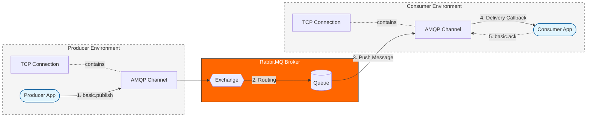

# RabbitMQ

> **AMQP** - Advanced Message Queuing Protocol. Built **on top of TCP**.

**RabbitMQ** is a message broker that offers a flexible and reliable system for transmitting messages between systems.  
It supports the **AMQP protocol**.

**Distributed task processing** - meaning that distributed system processes messages by **publisher confirmations** that
RabbitMQ got the message and **consumer acknowledgements** that consumer got and processed the message.



### 🧭 RabbitMQ Workflow

- `assertExchange` → create exchange
- `assertQueue` → create queue
- `publish` → send message to exchange with a routing key
- `consume` → listen to messages from queue

`amqplib` - node js package for rabbitmq

## 🧭 Exchange Types

**Direct** - (Default one) Routes to queue based on exact match on `routingKey` 

**Topic** - Pattern match.  
Better using an example:
- `*` - exactly one word
- `#` - zero or more words
Given a published message with a routing key: `iphone.17.black`
1) `iphone.*.black`   → match     (* matches "17")
2) `iphone.#`         → match     (# matches "17.black")
3) `samsung.#`        → mismatch  (different first word)  

**Fanout** - Broadcast to all queues. Ignore the routing key.  

**Headers** Match on custom headers instead of keys  

> 💡 `iphone.*.black` is called binding pattern

## 🔁 Message Ordering

- ❌ **No by default**
- Messages in a **single queue** are delivered in order
- To ensure order: use **"one queue per consumer"** pattern. Each consumer processes messages from it's own queue

## 📡 Channels in RabbitMQ

**Channels** are virtual connections inside a single TCP connection to the RabbitMQ.

- Created and managed using the AMQP protocol.
- Multiple channels can be opened per connection.
- Used to isolate different operations (e.g., publishing vs consuming) in the same connection.
- Lightweight and fast – avoids the overhead of opening multiple TCP connections.

> ⚠️ It's important to never share a channel between producers and consumers. Always create separate channels for each logical responsibility.

## 💾 Durable Messaging

| Option                                 | Behavior                        |
| -------------------------------------- | ------------------------------- |
| `deliveryMode: 1`                      | Non-persistent queue            |
| `deliveryMode: 2`                      | Message survives broker restart |
| `assertQueue(..., { durable: true })`  | Queue survives broker restart   |
| `assertQueue(..., { durable: false })` | Temporary queue                 |

> Durable messages `deliveryMode: 2` require durable queue to matter

## ✅ Acknowledgements 

- **Manual ack**: `channel.ack(msg)`
  - Used for `at-least-once`
  - Use for **critical operations** (e.g. orders, payments). Do the operation, then acknowledge
  - Set with: `{ noAck: false }` in `channel.consume(...)`

- **Auto ack**: `{ noAck: true }`
  - Used for `at-most-once`
  - Use for **non-critical data** (e.g. logs, metrics)
  - Message is treated as handled immediately upon delivery

## ⏱️ Delayed Retries (Plugin)

What if microservice is dead, message **fails to be acknowledged** and **infinitely keeps trying** ?

Use the community plugin `rabbitmq_delayed_message_exchange` to retry messages with a delay.

- Enable on the broker: `rabbitmq-plugins enable rabbitmq_delayed_message_exchange`.
- Declare an exchange of type `x-delayed-message` with argument `x-delayed-type` (e.g., `direct`).
- Publish with header `x-delay` in milliseconds. Broker delivers after the delay.

**Tiny Example**
```js
const ch = await conn.createChannel();
await ch.assertExchange('retry-ex', 'x-delayed-message', {
  durable: true,
  arguments: { 'x-delayed-type': 'direct' },
});
await ch.assertQueue('jobs', { durable: true });
await ch.bindQueue('jobs', 'retry-ex', 'jobs');

// publish with 5s delay
ch.publish('retry-ex', 'jobs', Buffer.from(JSON.stringify({ id: 1 })), {
  headers: { 'x-delay': 5000 },
  persistent: true,
});
```

## 🗃️ RabbitMQ vs Kafka Persistence

**RabbitMQ**:

- Messages can be persisted with:
- `channel.assertQueue('q', { durable: true })`
- `channel.sendToQueue('q', Buffer.from(msg), { deliveryMode: 2 })`
- ❌ **Messages are deleted after delivery**
- Designed for **message passing**, not long-term storage

**Example:** Multiple workers consume tasks.

**Kafka**:

- Stores messages on disk for a **configurable retention period**
- ✅ Consumers can **re-read** messages multiple times "Replayability"
- Designed for **event streaming** and **log storage**.

**Example:** Frontend sends events to analytics.

## 🧱 Role of Queues in Server Architecture

1. **Load Balancing Among Handlers**

   - Distribute tasks across multiple workers
   - Add more consumers to scale under high load

2. **Message Buffering for Resilience**

   - Queue stores incoming messages if handlers are slow/unavailable
   - Prevents message loss during spikes or failures

3. **Ordered & Reliable Processing**

   - Ensures messages are processed **in the order sent**
   - Combined with **acknowledgements**, guarantees reliability

## Smart broker dumb consumer

- `RabbitMQ` is smart broker
- In `RabbitMQ` the **broker (server)** manages all the logic for delivery, routing, and ordering of messages
- **Consumer (client)** only processes and acknowledgments messages.
- **Simplifies client code**, **reduces the load** on the consumer.

## RabbitMQ Core Entities

- **Exchange**  
  Think of an exchange like a post office sorter: it receives every incoming message and, based on rules, decides which queue(s) should get it.

- **Queue**  
  A queue is like your home mailbox: messages sit here until a consumer (you) comes by and picks them up.

- **Binding**  
  A binding is the address label that links an exchange to a queue. It tells the exchange, “If a message matches this pattern, deliver it to that queue.”

- **Virtual Host (vhost)**  
  A virtual host is like an apartment building with separate mailrooms: it provides isolated namespaces so multiple apps can use the same RabbitMQ server without stepping on each other’s messages.

- **Connection**  
  A connection is the TCP “phone line” between your application and the RabbitMQ broker. You usually open one per application instance.

- **Channel**  
  A channel is like an individual phone call on that line: it’s a lightweight, multiplexed session over a single connection. Best practice is to do most operations over channels rather than opening many connections.

- **Message**  
  The actual letter you send: it carries a payload (body) and optional metadata (headers, routing key, TTL). Exchanges and queues handle messages.

## 📬 Delivery Guarantees

- **At-least-once**
  - Broker keeps trying until it gets an ack. Requeue if consumer crashes
  - Use with manual acknowledgements and idempotent handlers.  
  - *Example*: order service rechecks "charge already done?" before charging again.
- **At-most-once**
  - Message is delivered zero or one time. If consumer dies mid-work, message is gone.
  - Use with auto ack when losing a message is acceptable.
  - *Example*: analytics counter for user action.
- **Exactly-once**
  - Goal: handle a message *just one time*, even if retries happen under the hood.
  - Combine *at-least-once* delivery with idempotency.  
  - *Example*: billing worker checks db for matching `idempotency key` or `transaction id`.  
  Is this message processed already ?

## ⚔️ RabbitMQ vs Kafka

> 💡 In *Kafka* **Offset** = the unique, incremental position number of each message inside a Kafka **partition**.
> 💡 Kafka **topic** (which you might think of as “a queue”) is split into multiple **partitions** for scalability and parallelism.

**Kafka** looks like this:

```sql
Topic: payments
 ├── Partition 0:  offset 0 1 2 3 4 ...
 ├── Partition 1:  offset 0 1 2 3 4 ...
 └── Partition 2:  offset 0 1 2 3 4 ...

```
| Feature           | RabbitMQ                                                     | Kafka                                                              |
| :---------------- | :----------------------------------------------------------- | :----------------------------------------------------------------- |
| **Broker Type**   | **Smart Broker**: Manages message routing, queuing, and delivery logic (pushes messages to consumers). | **Dumb Broker (Log-based)**: Simple, immutable log of messages. Consumers pull messages and manage their own state (offsets). |
| **Persistence**   | Messages are typically **deleted after delivery/acknowledgment**. Durability options (durable queues, durable messages) ensure survival of broker restarts, but not long-term storage or replayability. | All messages are **persisted to disk** in an immutable log for a configurable retention period. Supports re-reading messages. |
| **Delivery**      | **At-Least-Once** (with acknowledgments) by default. At-most-once (by disabling acks). Exactly-once is complex and requires application-level logic. | **At-Least-Once** by default. Exactly-once achievable with Kafka Transactions. At-most-once by committing offsets before processing. |
| **Message Routing** | **Rich routing capabilities** via various Exchange types (Direct, Topic, Fanout, Headers). Built-in Fanout Exchange for broadcast. | Primarily **topic-based partitioning**. Fanout/broadcast achieved by multiple consumer groups subscribing to the same topic. |
| **Use Case**      | **Traditional message queuing**, task queues, complex routing. | **Event streaming**, log aggregation, real-time analytics, big data ingestion. |

## RabbitMQ usage example on a project:

```plaintext
RabbitMQ is a message broker that offers a flexible and reliable system for transmitting some messages between systems.
It supports the AMQP protocol. Also Rabbit enables distributed message or task processing, which is very beneficial in a microservices architecture like our online store.

In my project, there was a product service and an order service. Under normal circumstances, both services interacted with
other services via an API Gateway. However, in certain situations, such as checking product availability when
placing an order, my order service would directly send an HTTP request to the product service.
And actually this is where Rabbit came into play.

To improve architecture and avoid direct dependencies between microservices, we implemented Rabbit.
We used the concept of "exchanges" and "queues" in Rabbit to control how messages are transmitted.
So when the "Orders" service receives a new order, it sends a message with order information to an exchange (like product ID).
The exchange routes this message to a queue listened to by the "Products" service.

Once the "Products" service receives a message, it checks product availability. After checking, it sends a message
(like availability or lack thereof) back to another exchange which connected to a queue that the "Orders" service listens to.
And the main advantage of using RabbitMQ in this scenario is that interaction between services becomes completely asynchronous.
That is, services don't block while waiting for a response from another service. Moreover, using RabbitMQ ensures reliability,
as even if one of the services fails, messages aren't lost; they remain in the queue until they are successfully processed.
```
